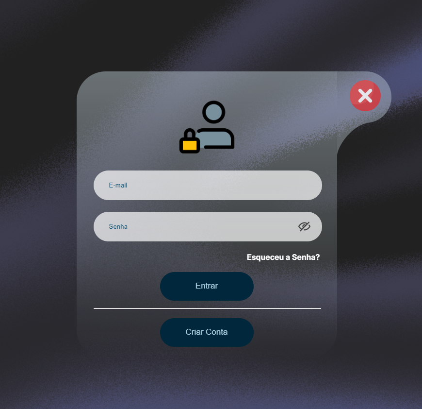
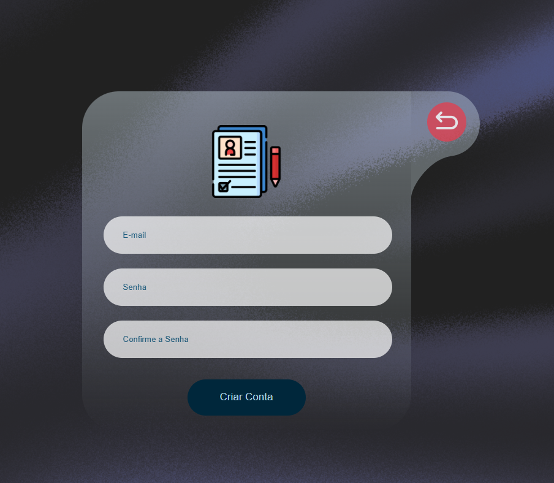

# Projeto: Lista de Pessoas na Lista Suja de Trabalho Análogo à Escravidão

Este projeto visa criar um **site informativo** para mostrar a lista de pessoas e empresas que estão na **lista suja de trabalho análogo à escravidão**, conforme os dados fornecidos pelo **Ministério do Trabalho e Emprego (MTE)**. O objetivo é sensibilizar e informar sobre essa grave questão social, ajudando a promover a conscientização e a combater práticas de exploração de trabalho.

## Funcionalidades

- **Exibição de Lista**:
  - Visualização de dados relacionados a pessoas e empresas envolvidas com trabalho análogo à escravidão.
  - A lista incluirá nomes e detalhes de indivíduos que fazem parte dessa lista.
  
- **Dashboard**:
  - Menu de navegação para acessar diferentes páginas, como a página de "Conscientização" e "Criador".
  - Seção sobre o autor do projeto, com links para suas redes sociais.

- **Página de Conscientização**:
  - Informações sobre os impactos e a importância de erradicar o trabalho análogo à escravidão.
  - Links e textos educativos para aumentar a conscientização sobre o tema.

- **Tela de Cadastro/Login**:
  - Acesso restrito para gerenciar as informações da lista (a ser definida em etapas posteriores).

## Tecnologias Utilizadas

- **HTML5**: Estrutura e conteúdo da página.
- **CSS3**: Estilização e design responsivo.
- **JavaScript**: Funcionalidades de interação, como mostrar/ocultar senha.
- **API ou Banco de Dados (futuro)**: Integração para exibir a lista de pessoas e empresas.

## Como Usar

1. **Clone o repositório:**
git clone [https://github.com/seu-usuario/seu-repositorio.git](https://github.com/RithonBR/EscravizadorAqui)

2. **Instale as dependências (se necessário)**:
- O projeto não depende de bibliotecas externas no momento, apenas HTML, CSS e JavaScript.

3. **Abra o arquivo `index.html` ou qualquer página diretamente no seu navegador.**

4. **Navegue pelas páginas:**
- Acesse o Dashboard e visualize a lista de pessoas e empresas.
- Veja a página de Conscientização para entender mais sobre o tema.

## Como Contribuir

1. Faça um **fork** deste repositório.
2. Crie uma nova branch para sua feature (`git checkout -b nova-feature`).
3. Faça commit das suas alterações (`git commit -am 'Adiciona nova feature'`).
4. Envie para o repositório original (`git push origin nova-feature`).
5. Abra uma **pull request**.

## Imagens

- **Tela de Login:**

- **Tela de Cadastro:**

## Licença

Este projeto está licenciado sob a Licença MIT - veja o arquivo [LICENSE](LICENSE) para mais detalhes.
